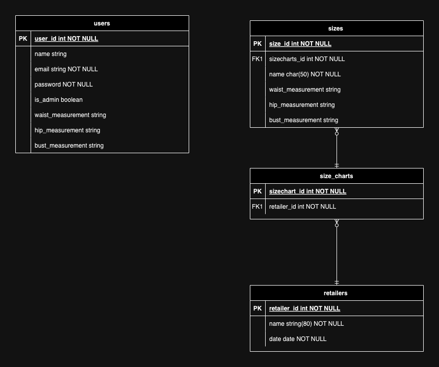

### T2A2: API WEBSERVER 

### Getting Started 

The instructions below will create a copy of this project to run on your local machine. 
To deploy the project on a live system refer to the 'How to Deploy' section included below. 

#### Prequisites 

ensure Python3 is installed on your device. 

#### Installation

<ol>
<li>
1. clone the repository 
HTTPS:
...
git clone https://github.com/celestemarieb/sizing_api.git 
...
SHH:
...
git clone git@github.com:celestemarieb/sizing_api.git 
...

<li>
2. navigate to the cloned directory 
...
cd sizing_api
...
</li>
<li>
3. (optional) create virtual environment 
...
python3 -m venv venv
...
</li>
<li>
4. activate the virtual environment
For Windows: 
...
venv/Scripts/activate
...

For Unix/macOS:
...
source venv/bin/activate
...
</li>
<li>
5. install the required dependencies: 
... 
pip install -r requirements.txt 
...
</li>
#### Configuration 

The application expects environment variables. A .env.sample file has been provided to store these. When these variables have been added rename the file to '.env'. 

#### Usage 
To create the databases used by the application run the following command: 
...
flask db create
...

To seed those databases with an initial set of information run the following command: 
... 
flask db seed
...

To start the flask server, run the following command 
... 
flask run
....

This will start the server at 
...
http://localhost:8080/.
...

#### R1 Problem Statement 

Clothing sizes are not standardised across retailers, particularly in womenswear. This means that significant waste is generated by clothing purchased and shipped that does not fit the purchaser, where consumers imperfectly translate their preferred size across brands. 

The "Sizing API" stores the dimensions of clothing sizes across retailers as well as the dimensions for an individual. 

This enables an individual to compare their personal dimensions to sizes available across retailers and quickly find sizes which suit them best. 

We expect that this will reduce waste by reducing the number of purchases or returns generated by ill-fitting clothing purchases. 

#### R2 Project Management 

Tasks are tracked in a github Project linked to the repository. It can be viewed here: [Sizing API Project](https://github.com/users/celestemarieb/projects/7)

Tasks are aligned with "Jobs to be Done" we imagine users may have when interacting with the API. An endpoint is created for each job. 

For example: A user may wish to add a new retailer to the database. They can do so via an endpoint - reflected in this task: [Add New Retailer](https://github.com/users/celestemarieb/projects/7/views/1?pane=issue&itemId=72087464) 

#### R3 Third-party Services, Packages and Dependencies

Third-party services, packages and dependences used by the app are included in the [requirements.txt](requirements.txt)file. 

Major packages in use include:
- Flask 

Flask is a microframework allowing Python to be used to build an API, a webpage, capable of handling user requests.  

- SQLAlchemy 

SQL Alchemy is a tool used to map the schema of the relational database to the classes used by the app. It has been used to convert Python class calls into SQL statements. The relational database in the app can be queried using Python. 

- Flask-SQLAlchemy 

Flask-SQLAlchemy is a Flask extension enables further easy interaction between the database in the Flask applcation through SQLAlchemy

- Marshmallow 
Marshmallow is a python library which enables object serialisation and deserialisation - this has been used to convert objects into JSON in order to store and receive that information. 

- Psycopg
Psycopg is a PostgresSQL database adapter for Python. It has been used to enable the full range of SQL operations on the PostgresSQL database created by the app. 

- Bcrypt 
Bcrypt is used to hash user passwords created by users so that they can be stored securely. 

- JWT Manager 
JWT Manager is a library which manages JSON Web tokens. It has been used to create an authentication system which can securely exchange a JSON object via the web. 

#### R4 Database System 

PostgresSQL, a relational database management system, has been used to create the relational databases which underlie the application. 

The drawback of using this system is a comparatively low speed when reading the database. 

However, this drawback is outweighed by the following benefits: 
- is an SQL-compliant database
- enables foreign keys to link data in two tables 
- is an open source system with a large community of users and multitude of support resources 
- supports JSON 

#### R5 Object-Relational Mapping System (ORM) used in this app 

The Object-Relational Mapping system used in this app is the SQLAlchemy package. It maps classes created and defined in Python to SQL statements. The package sepeates mapping and class design. 

#### R6 Entity Relationship Diagram (ERD) 

User profile information (id, email, name) is stored alongside the personal dimensions they provide (waist measurement, hip measurement, bust measurement). 

This design expects that users will create and maintain a single profile with one set of personal dimensions (one to one relationship).

Information about each size is stored in the 'sizes' table. This information includes the sizes name and dimensions (waist measurement, hip measurement and bust measurement). Also included is a foreign key, a size chart id. This design reflects the relationship between size charts and sizes, that is many sizes can be included in one size chart while an individual size will only be associated with one size chart. 

Information about each size chart is included in the 'size_charts' table. This include the retailer that owns and publishes the size chart and the sizes contained within the size chart. 

This design expects that a retailer may publish many size charts and sizes. A size chart is only published, used and maintained by one retailer, we do not expect a size chart or sizes to be common across retailers. 

Information about each retailer is included in the 'retailers' table. This includes the retailers name and the date at which the record was created. This design expects that each size and size chart will be associated with only one retailer, however each retailer may create and maintain many size charts and sizes. 

This design is normalised and prevents duplicate records in tables. We expect the application to compare and contrast information from a record in the user table with records in the size table. Less often will reference be made to size charts and retailers except to filter results. 

#### R7 Implemented Models and their Relationships

The following classes are used in the application : 
<ul>
    <li>
- User 
    </li>
    <li>
- Size 
    </li>
    <li>
- SizeChart 
    </li>
    <li>
- Retailer
    </li>
</ul>

A User is a standalone class unrelated to the other classes. It has the following attributes : user id, name, email, role (is_admin), waist measurement, hip measurement and bust measurement. 

Each User will have one record and set of attributes. The user id must be unique. 

A Size contains an id, name, waist measurement, hip measurement and bust measurement. 

Each Size belongs to a Size chart.  A SizeChart many be associated with many Sizes. 

The class SizeChart contains a sizechart id and retailer id. 

A SizeChart belongs to one Retailer. 

A Retailer may be associated with many SizeChharts and by extension many Sizes. 

#### R8 API Endpoints

The following API endpoints are available:

<ul>
    <li>
    ...
    POST /auth/register - Create a New User (1)
    ...
    </li>
    <li>
    ...
    POST /auth/login - Login as an Existing User (2)
    ...
    </li>
    <li>
    ...
    POST /sizes/new - Create a New Size (3)
    ...
    </li>
    <li>
    ...
    PUT /sizes/update - Update a Size (4)
    ...
    </li>
    <li>
    ...
    DELETE /sizes/delete - Delete a Size (5)
    ...
    </li>
    <li>
    ...
    GET /sizes/all - Display All Sizes (6)
    ...
    </li>
    <li>
    ...
    GET /fit/find - Find A Good Fit (a size which matches the users dimensions) (7)
    ... 
    </li>
</ul>

##### Example Usage 

- Create a New User (1)

Request: 
...
POST /auth/register 

{
	"name": "User 1",
	"email": "user@email.com",
	"password": "123456",
    "is_admin":"true",
    "waist_measurement":"100",
    "hip_measurement":"100",
    "bust_measurement":"100"
}
...
Response:
...
HTTP/1.1 201 Created 
{
    "id":1,
    "name": "user's name"
    "email": "user's email address"
}
...

- Login as an Existing User (2)
Request:
...
POST /auth/login 

{
    "email":"user's email address"
    "password":"user's password"
}
...
Response:
...
{
    "email": "user's email address"
    "is_admin": ""
    "token":"token"
}
...

- Create a New Size (3)
Request:
...
POST /sizes/new 
{
	"name":"XS",
	"bust_measurement":"123",
	"waist_measurement":"456",
	"hip_measurement":"789",
	"sizechart_id":"123"
}
...
Response:
...
201 Created 
{
	"bust_measurement": "123",
	"hip_measurement": "789",
	"id": 4,
	"name": "XS",
	"sizechart_id": 123,
	"waist_measurement": "456"
}
...

- Update a Size (4)
Request:
    ...
    PATCH /sizes/update 
    {
        "id":"size id"
        "name":"Updated Name"
        ... 
    }
    ...

Response:
    ...
    HTTP/1.1 200 OK

    {
        "id":"id"
        ... : "updated values"
    }
    ...

- Delete a Size (5)
Request:
    ...
    DELETE /sizes/delete 
    {
        "id":"size id"
    }
Response:
    ...
    HTTP/1.1 200 OK
    {
        "message":"size deleted"
    }
    ...

- Display All Sizes (6)
Request:
    ...
    GET /sizes 
    ...
Response:
    ...
    HTTP/1.1 200 OK
    [
        {
            "id":1
            "name":"Size Name"
            "":""
        },
        {
            "id":2
            "name":"Another Size Name" 
            "":""
        }
    ]
    ...
- Find A Good Fit (a size which matches the users dimensions) (7)
Request:
    ...
    GET /fit/find 
    {
        "id":"user id"
    }
    ... 
Response: 
    ...
    HTTP/1.1 200 OK
    {
        "size name": ""
        "retailer name":""
    }
    ...

### Future Features 

In future, we expect to add the following endpoints to manage user information stored in the users database: 

- Update User Details 
- Delete a User 

## Credits and Acknowledgments 
### Sizing Data 

The sizing data prepopulated into the application is derived from publicly available size charts published by Uniqlo and ASOS. 

Links to original sources are provided below: 

- Uniqlo: https://www.uniqlo.com/ca/en/size/409212.html

- ASOS: https://www.asos.com/au/discover/size-charts/women/

## License

Copyright (c) 2024 Celeste Bird 

[MIT](./license.txt)

